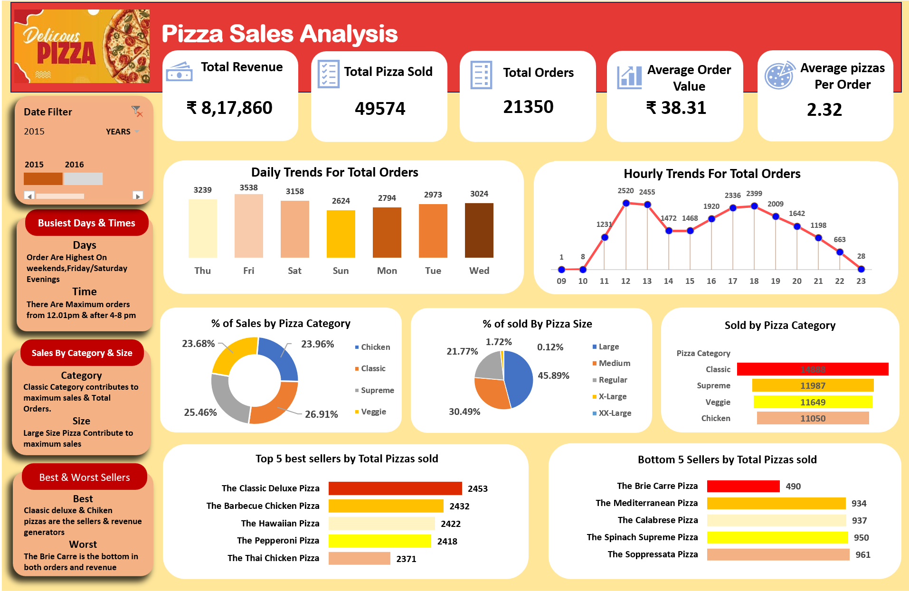

🔍 Key Insights

Total Revenue and Total Orders

Top 5 Best-Selling Pizzas

Bottom 5 Least-Selling Pizzas

Sales by Category and Size

Daily and Monthly Sales Trends

🛠 Tools Used

SQL Server,Advanced Excel,Pivot Tables,Slicer,Charts & Data Visualization

📁 Files Included

Pizza_Sales_Dashboard.xlsx

Pizza Sales SQL Queries.docx

Dashboard.png

📸 Dashboard Preview

  

🚀 Outcome

This dashboard provides clear insights into pizza sales performance by analyzing revenue, orders, and product demand. It helps identify top-selling items, peak sales periods, and customer preferences.

The analysis supports better decision-making by enabling demand forecasting, optimizing inventory levels, and improving sales strategies. Based on trends, the business can plan stock efficiently and focus on high-performing products to drive future growth.
DOWNLOAD DATASET FROM HERE - https://drive.google.com/drive/folders/1Te8Wead-f9DxrLuUrdQTXnHgNH5sNWXf?usp=drive_link
